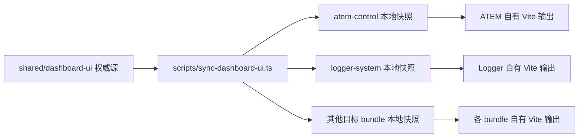

# LeafSeamer Dashboard UI 统一设计

- 日期：2026-07-13
- 状态：待审阅
- 视觉方向：Dense Hardware Console
- 信息层级：Tiered Controls
- 界面语言：英文

## 1. 背景

LeafSeamer 的 Dashboard 面板由多个可独立部署的 NodeCG bundle 提供。当前 Log Viewer 与 VB Matrix Control 已形成较成熟的深色控制台风格，但 ATEM、Mixer、OBS、Schedule Manager、Seamer 和 Backup System 仍混有默认 HTML、内联样式以及各自定义的颜色和控件语义。这会降低控制室环境中的扫描效率，也增加后续维护成本。

本次设计在不改变播控协议和业务行为的前提下，统一非 Graphics Dashboard 的视觉语言、信息层级、交互状态与错误呈现，同时继续保证每个 bundle 可独立安装、构建和运行。

## 2. 目标

1. 为所有非 Graphics Dashboard 建立一致的 Dense Hardware Console 设计语言。
2. 使用 Tiered Controls 保证实时状态和高频操作常驻，低频配置按层级折叠。
3. 让每个 bundle 同时具备源码独立、构建独立和运行时独立能力。
4. 保持现有 NodeCG 消息名、消息 payload、Replicant schema、权限检查和设备控制逻辑不变。
5. 统一加载、空、禁用、等待、成功、警告、失败和危险状态。
6. 解决窄 NodeCG 面板中的内容溢出、文字遮挡、矩阵压缩和工具栏跳动问题。

## 3. 非目标

1. 不修改 `graphics-package` 的 Dashboard 或播出 Graphics。
2. 不为没有 Dashboard 的 adapter 或 service 人为增加界面。
3. 不在本次改造中重写设备协议、数据模型、认证机制或 SecretManager。
4. 不引入运行时依赖的全局主题 bundle、全局 UI 服务或跨 bundle UI Replicant。
5. 不翻译设备返回文本；LeafSeamer 自有界面文字统一使用英文。

## 4. 已批准的核心决策

### 4.1 视觉方向

采用 Dense Hardware Console：深色、高对比、紧凑、适合重复操作和快速扫描。控制命令与设备状态使用不同颜色语义，避免将品牌色、状态色和危险色混用。

### 4.2 信息层级

采用 Tiered Controls：

1. 顶部常驻 bundle 身份、活动目标和连接状态。
2. 第二层常驻直播期间最高频的操作与关键读数。
3. 第三层使用可折叠章节容纳低频配置、映射、来源和高级工具。
4. 第四层隔离不可逆操作，并使用明确的危险样式和确认流程。

### 4.3 共享方式

采用“统一权威源 + 自动同步本地快照”。共享设计只有一份权威源，但每个目标 bundle 在自己的源码目录中保存版本化快照。快照纳入 Git，因此单独复制 bundle 后不需要仓库级 UI 包也能安装、构建和运行。

## 5. 独立性架构

### 5.1 权威源

建议在 `shared/dashboard-ui/` 保存：

- `tokens.css`：颜色、间距、尺寸、字体、边框、焦点和状态令牌。
- `base.css`：reset、页面基础布局、可访问性辅助类和滚动条规则。
- `components.css`：按钮、字段、状态条、工具栏、表格、折叠区、对话框和 Toast 样式。
- `components/`：不包含业务状态的轻量 React 组件。
- `targets.json`：允许同步的 bundle 白名单和 UI 版本。

### 5.2 本地快照

同步脚本把权威源生成到 `bundles/<bundle>/src/dashboard/_leaf-ui/`。每份快照包含可直接导入的 CSS、组件源码和 `manifest.json`。Manifest 至少记录 UI 版本、源内容哈希和生成时间。生成文件头部使用中文注释说明来源以及禁止手工修改。

### 5.3 同步与检查

- `npm run ui:sync`：显式更新所有目标 bundle 的本地快照。
- `npm run ui:check`：重新计算内容并检查版本、哈希和目标清单；发现漂移时失败，但不修改文件。
- 根构建和 CI 在逐 bundle 构建前执行 `ui:check`。
- 单个 bundle 的 `npm run build` 只读取本地快照，不访问仓库级权威源。
- 静态检查禁止 Dashboard 从其他 bundle 或仓库级 UI 目录执行运行时导入。

### 5.4 独立性契约

单个目标 bundle 被复制到其他 NodeCG 安装后，应满足：

1. 不要求安装 LeafSeamer 的其他 bundle。
2. 不要求存在 `shared/dashboard-ui/` 或同步脚本。
3. 通过自己的 `package.json` 安装全部前端依赖。
4. 通过自己的 Vite 配置完成 Dashboard 与 extension 构建。
5. 浏览器运行时只加载该 bundle 自己输出的 HTML、JS 和 CSS。

## 6. 改造范围

目标 bundle：

- `atem-control`
- `backup-system`
- `logger-system`
- `mixer-control`
- `obs-control`
- `schedule-manager`
- `seamer`
- `vb-matrix-control`

明确排除：

- `graphics-package`
- 所有没有 Dashboard 声明的 `seamer-adapter-*`
- `schedule-adapter-*`
- `data-sync-service`

## 7. 视觉令牌

### 7.1 颜色

| 用途 | 值 | 规则 |
| --- | --- | --- |
| 页面底色 | `#0c0e11` | Dashboard 根背景 |
| 主表面 | `#14171b` | 面板内容区 |
| 抬升表面 | `#20242a` | 控件、悬停和展开区 |
| 深层表面 | `#090b0d` | 输入框、日志和矩阵底色 |
| 边界 | `#2a3037` | 分区和控件边界 |
| 主文字 | `#f2f4f6` | 标题与关键值 |
| 辅助文字 | `#959da7` | 标签与说明 |
| 弱化文字 | `#68717c` | 占位和禁用态 |
| 命令蓝 | `#61a9ff` | 主命令、焦点和当前选择 |
| 正常绿 | `#52d273` | 已连接、成功、运行正常 |
| 警告黄 | `#ffbd4a` | 降级、等待人工处理 |
| 失败红 | `#ff626b` | 错误、不可逆操作 |

蓝色不表示设备健康；绿、黄、红不用于普通装饰。所有状态同时提供文字或图标，不只依赖颜色。

### 7.2 尺寸与排版

- 4px 基础栅格，常用间距为 4、8、12、16 和 24px。
- 控件和容器圆角统一为 4px。
- 正文 12–13px，面板标题 16–18px，章节标签 11px。
- 字体使用系统 UI 字体；IP、端口、时间、计数和设备 ID 使用等宽字体。
- 字号不随视口宽度缩放，字距保持 0。
- 图标按钮和矩阵节点使用稳定宽高，加载和状态变化不得推动周围布局。

## 8. 共享组件

共享组件只处理表现和通用交互，不直接读取 Replicant 或发送 NodeCG 消息：

- `PanelHeader`：bundle 名称、活动目标、连接状态和顶部持续性错误。
- `StatusBadge` 与 `MetricStrip`：状态文本、关键计数和设备读数。
- `Button` 与 `IconButton`：主命令、中性命令、危险命令、pending 和 disabled。
- `Field`、`Select`、`Toggle` 与 `SegmentedControl`：统一标签、帮助文本和错误状态。
- `Section` 与 `Disclosure`：无卡片嵌套的分区和折叠层级。
- `Toolbar`：在窄面板中稳定换行且不改变按钮尺寸。
- `CompactTable`、`LogRow` 与 `MatrixViewport`：高密度数据和横向滚动。
- `ConfirmDialog`、`ToastRegion` 与 `ErrorBoundary`：确认、临时反馈和渲染错误隔离。

按钮中的常见操作图标采用 Lucide。目标 bundle 必须在自己的 `package.json` 中声明所需图标依赖，保证独立安装；不得手绘已有的通用图标。

## 9. 面板信息结构

### 9.1 ATEM Control

- 常驻：连接状态、Program、Preview、切换方式、CUT 和 AUTO。
- 次级：输入源和宏操作。
- 折叠：地址、端口、重连和低频连接参数。

### 9.2 Mixer Control

- 常驻：连接状态、活动设备、输入与输出通道条。
- 次级：通道映射、Mute、增益和输出操作。
- 折叠：设备发现、地址和连接参数。
- 通道条使用横向滚动，不在窄面板中压缩到不可操作。

### 9.3 OBS Control

- 常驻：当前 Scene、Transition、Streaming/Recording 状态和开始/停止命令。
- 次级：Scenes 与 Sources，按独立章节折叠。
- 折叠：推流目标、认证信息和 WebSocket 连接参数。
- Secret 字段继续遵循现有 SecretManager 与认证命令流程。

### 9.4 VB Matrix Control

- 常驻：活动 Matrix、连接状态和刷新状态。
- 主工作区：Patch Matrix，支持直接 patch/de-patch。
- 次级：单点 Patch Control。
- 折叠：Preset Manager、Preset Bank 和 Network Configuration。
- Matrix 横向滚动，输入名称与输出表头保持可见，不压缩节点。

### 9.5 Logger System

- 常驻：搜索、Bundle、Level 和自动清理周期。
- 主工作区：日志列表和新日志提示。
- 工具区：导出和清空；清空需要确认。

### 9.6 Schedule Manager

- 常驻：同步状态、当前条目、下一条目和可用于 Seamer 的触发字段。
- 主工作区：完整播单、筛选和选中状态。
- 折叠：外部数据源状态、字段映射和同步详情。

### 9.7 Seamer

- 常驻：运行状态、启停状态和当前流程。
- 主工作区：流程卡和 Trigger 列表。
- 编辑器：能力参数按 When 和 Then 分组。
- 删除 Trigger 或流程必须确认。

### 9.8 Backup System

- 常驻：敏感度级别、备份范围和 Create Backup。
- 次级：备份历史和结果。
- 选择包含 Secret 的级别时显示风险说明并要求确认。

## 10. 交互与错误处理

### 10.1 命令状态

设备命令点击后进入 pending，并在等待回执期间阻止重复提交。只有消息回执或 Replicant 更新后才显示成功；失败时恢复为最后确认状态并在操作附近呈现错误。不得用纯前端乐观状态伪造设备成功。

### 10.2 错误层级

- 持续性错误：连接中断、`AUTH_REQUIRED`、Secret 不可用等显示在顶部状态区。
- 字段错误：格式、必填和范围错误显示在字段附近。
- 命令错误：操作附近提示并同步到 Toast。
- 渲染错误：由每个面板自己的 Error Boundary 隔离，并提供 Reload。

### 10.3 确认策略

CUT/AUTO、Scene 切换、Patch、Mute 等直播高频操作不增加确认步骤。删除 preset、trigger、backup，清空日志和重置配置等不可逆操作使用确认对话框。现有设备命令的消息名与 payload 不变。

### 10.4 可访问性

- 所有交互可通过键盘访问，并显示清晰焦点环。
- 图标按钮提供英文 tooltip 和可访问名称。
- 状态不只依赖颜色。
- 禁用态说明原因，pending 状态保留稳定尺寸。
- 对话框管理焦点进入与返回，Toast 使用合适的 live region。

## 11. 响应式规则

1. 以 NodeCG 窄面板为首要场景，最低验收宽度为 320px。
2. 工具栏允许整组换行，不缩小按钮文字或图标。
3. 表格、Matrix 和通道条使用内部横向滚动与固定关键表头。
4. 长 IP、设备名和错误文本允许换行或省略，并通过 tooltip 查看完整值。
5. 不允许文字遮挡、控件重叠、动态状态引起明显布局跳动。

## 12. 验证方案

### 12.1 自动检查

1. `ui:check` 验证目标清单、版本、哈希和快照完整性。
2. 静态检查禁止跨 bundle Dashboard UI 导入。
3. TypeScript 类型检查和现有测试全部通过。
4. 八个目标 bundle 分别完成 extension 和 Dashboard Vite 构建。
5. 对现有消息名、payload 和 Replicant schema 增加契约回归检查。

### 12.2 视觉与交互检查

Playwright 在 320、480 和 768px 宽度生成截图，并检查：

- 页面是否存在水平溢出或文字遮挡。
- Matrix、通道条和表格是否使用预期的内部滚动。
- 键盘焦点、折叠区、对话框、Toast、loading、empty 和 error 状态。
- 按钮 pending 时是否保持尺寸稳定。

### 12.3 关键手动流程

- ATEM 与 Mixer 连接和控制。
- OBS Scene、Source、Streaming 与 Recording。
- VB Matrix 点击 patch/de-patch、单点控制和 preset。
- Log Viewer 搜索、Bundle/Level 筛选、自动清理、导出和清空。
- Schedule 同步、筛选与 Seamer 触发字段选择。
- Seamer 流程与 Trigger 编辑。
- Backup 敏感度选择、Secret 确认和备份历史。

### 12.4 独立性检查

CI 在临时目录中只复制一个目标 bundle，安装其 `package.json` 声明的依赖并执行 build。检查其输出不引用其他 LeafSeamer bundle、仓库级 UI 源或跨 bundle 静态资源。

## 13. 实施顺序

1. 建立权威源、同步脚本、快照检查和基础组件。
2. 以 Logger System 和 VB Matrix Control 作为参考实现并校准视觉规范。
3. 改造 ATEM、Mixer 和 OBS 设备控制面板。
4. 改造 Schedule Manager、Seamer 和 Backup System。
5. 完成逐 bundle 构建、Playwright 检查、独立性检查和手动播控回归。
6. 更新开发日志、README 和相关手册，明确 UI 同步与独立构建方法。

## 14. 风险与缓解

| 风险 | 缓解措施 |
| --- | --- |
| 本地快照与权威源漂移 | `ui:check` 在 CI 和总构建中强制校验 |
| UI 统一引入跨 bundle 依赖 | 只允许导入本 bundle 的快照，并执行静态检查 |
| 高密度布局导致可访问性下降 | 稳定点击尺寸、键盘焦点、文字状态和多宽度截图检查 |
| 样式改造误改设备行为 | 保持消息与 Replicant 契约，增加关键流程回归 |
| Matrix 或通道条在窄面板失真 | 使用内部滚动、固定表头和稳定节点尺寸 |
| 大范围一次性改造难以定位回归 | 按参考实现、设备面板、编排面板分阶段交付 |

## 15. 完成标准

只有同时满足以下条件才视为完成：

1. 八个目标 bundle 使用同一版本的本地 UI 快照。
2. `graphics-package` 没有任何代码或构建产物变化。
3. 所有自动检查、逐 bundle 构建和关键手动流程通过。
4. 320、480、768px 下无不合理重叠、遮挡和页面级水平溢出。
5. 单独复制任一目标 bundle 后可安装、构建并运行。
6. UI 文案统一为英文，现有业务协议和错误语义保持兼容。
