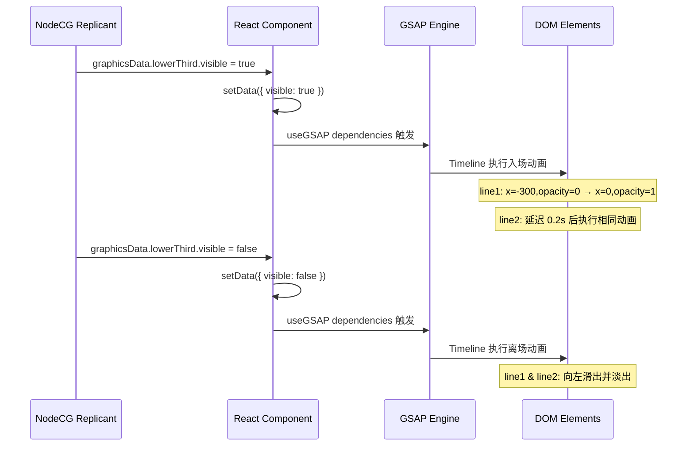

# GSAP 动画使用指南

> 创建时间: 2025-12-04  
> 项目: LeafSeamer Graphics Package  
> 版本: v1.0

---

## 📋 概述

本文档为 LeafSeamer 项目中使用 GSAP (GreenSock Animation Platform) 制作图文包装动画的指南。

### 为什么选择 GSAP?

- ⚡ **性能卓越**: GPU 加速,稳定 60fps,适合直播环境
- 🎯 **精确控制**: Timeline 系统,毫秒级动画序列控制
- 🔧 **React 集成**: 官方 `@gsap/react` 包,完美适配 React 18+
- 📺 **OBS 兼容**: 在 OBS 浏览器源中完美渲染

---

## 🚀 快速开始

### 安装依赖

```bash
cd bundles/graphics-package
npm install gsap @gsap/react
```

### 基础用法

```typescript
import { useRef } from 'react';
import { useGSAP } from '@gsap/react';
import gsap from 'gsap';

const MyGraphic = () => {
  const containerRef = useRef<HTMLDivElement>(null);
  const elementRef = useRef<HTMLDivElement>(null);

  useGSAP(() => {
    // 动画代码会在组件挂载时执行
    gsap.to(elementRef.current, {
      x: 100,
      opacity: 1,
      duration: 1,
      ease: 'power2.out'
    });
  }, { scope: containerRef }); // 自动清理

  return (
    <div ref={containerRef}>
      <div ref={elementRef}>Animated Element</div>
    </div>
  );
};
```

---

## 🎨 Lower Third 动画实现

### 当前实现 (`lower-third.tsx`)

```typescript
import { useGSAP } from '@gsap/react';
import gsap from 'gsap';

const LowerThird = () => {
  const containerRef = useRef<HTMLDivElement>(null);
  const line1Ref = useRef<HTMLDivElement>(null);
  const line2Ref = useRef<HTMLDivElement>(null);
  const [data, setData] = useState<LowerThirdData>({
    visible: false,
    line1: '',
    line2: ''
  });

  // GSAP 动画控制
  useGSAP(() => {
    if (data.visible) {
      // 入场动画
      gsap.timeline()
        .fromTo(line1Ref.current,
          { x: -300, opacity: 0 },
          { x: 0, opacity: 1, duration: 0.6, ease: 'power2.out' }
        )
        .fromTo(line2Ref.current,
          { x: -300, opacity: 0 },
          { x: 0, opacity: 1, duration: 0.6, ease: 'power2.out' },
          '-=0.4' // 重叠 0.4 秒
        );
    } else {
      // 离场动画
      gsap.timeline()
        .to(line1Ref.current, { x: -300, opacity: 0, duration: 0.4 })
        .to(line2Ref.current, { x: -300, opacity: 0, duration: 0.4 }, '-=0.3');
    }
  }, { scope: containerRef, dependencies: [data.visible] });

  return (
    <div ref={containerRef}>
      <div ref={line1Ref} style={{ opacity: 0 }}>{data.line1}</div>
      <div ref={line2Ref} style={{ opacity: 0 }}>{data.line2}</div>
    </div>
  );
};
```

### 动画流程说明



---

## 🎯 核心 API 说明

### 1. `useGSAP` Hook

**作用**: 自动管理 GSAP 动画生命周期,避免内存泄漏

**签名**:

```typescript
useGSAP(
  callback: () => void,
  options?: {
    scope?: React.RefObject<HTMLElement>;
    dependencies?: any[];
  }
)
```

**参数**:

- `callback`: 动画逻辑函数
- `scope`: 动画作用域 (用于自动清理)
- `dependencies`: 依赖项数组,变化时重新执行动画

**示例**:

```typescript
useGSAP(
  () => {
    gsap.to(".element", { x: 100 });
  },
  {
    scope: containerRef,
    dependencies: [isVisible],
  }
);
```

---

### 2. `gsap.to()` - 目标动画

从当前状态动画到目标状态

```typescript
gsap.to(target, {
  x: 100, // transform: translateX(100px)
  y: 50, // transform: translateY(50px)
  opacity: 1, // 透明度
  scale: 1.2, // transform: scale(1.2)
  rotation: 360, // transform: rotate(360deg)
  duration: 1, // 持续时间 (秒)
  ease: "power2.out", // 缓动函数
});
```

---

### 3. `gsap.fromTo()` - 起始目标动画

明确指定起始和目标状态

```typescript
gsap.fromTo(
  target,
  { x: -100, opacity: 0 }, // 起始状态
  { x: 0, opacity: 1, duration: 1 } // 目标状态
);
```

---

### 4. `gsap.timeline()` - 时间轴

创建动画序列

```typescript
const tl = gsap.timeline();

tl.to(".element1", { x: 100, duration: 1 })
  .to(".element2", { y: 50, duration: 1 })
  .to(".element3", { opacity: 1, duration: 0.5 }, "-=0.5"); // 重叠 0.5 秒
```

**时间控制**:

- `'-=0.5'`: 与上一个动画重叠 0.5 秒
- `'+=0.5'`: 在上一个动画结束后延迟 0.5 秒
- `'<'`: 与上一个动画同时开始
- `'>'`: 在上一个动画结束时开始

---

## 🎬 常用缓动函数 (Easing)

| Ease 函数      | 效果描述     | 适用场景       |
| -------------- | ------------ | -------------- |
| `power1.out`   | 轻度减速     | 简单淡入淡出   |
| `power2.out`   | 中度减速     | **推荐通用**   |
| `power3.out`   | 强烈减速     | 强调入场       |
| `power2.inOut` | 先加速后减速 | 往返动画       |
| `elastic.out`  | 弹性效果     | 引人注意的元素 |
| `back.out`     | 超出后回弹   | 按钮点击反馈   |
| `bounce.out`   | 弹跳效果     | 掉落物体       |

**图示**:

```
power2.out:  ▁▂▃▅▆▇█ (快速启动,平滑减速)
elastic.out: ▁▂▃▅▇█▆▅▇█▆▇█ (振荡后稳定)
back.out:    ▁▂▃▅▇████▇█ (超出后回拉)
```

---

## 🛠️ 实用技巧

### 1. 避免闪烁 - 初始状态设置

```typescript
// ❌ 错误: 初始可见,会闪烁
<div ref={elementRef}>Content</div>

// ✅ 正确: 初始不可见,由 GSAP 控制
<div ref={elementRef} style={{ opacity: 0 }}>Content</div>
```

---

### 2. 强制 GPU 加速 (OBS 环境推荐)

```typescript
gsap.to(element, {
  x: 100,
  force3D: true, // 强制使用 translate3d
  ease: "power2.out",
});
```

---

### 3. 复用 Timeline (性能优化)

```typescript
const tl = useRef<gsap.core.Timeline>();

useGSAP(() => {
  // 创建一次 Timeline
  tl.current = gsap
    .timeline({ paused: true })
    .to(".element", { x: 100 })
    .to(".element", { opacity: 0 });
}, []);

// 在依赖变化时重放
useEffect(() => {
  if (isVisible) {
    tl.current?.restart();
  } else {
    tl.current?.reverse();
  }
}, [isVisible]);
```

---

### 4. 交错动画 (Stagger)

批量元素依次动画

```typescript
gsap.to(".items", {
  y: 0,
  opacity: 1,
  duration: 0.5,
  stagger: 0.1, // 每个元素延迟 0.1 秒
  ease: "power2.out",
});
```

---

## 📊 性能监控

### 检测帧率

```typescript
useGSAP(() => {
  const tl = gsap.timeline({
    onUpdate: () => {
      if (gsap.ticker.fps < 30) {
        console.warn("FPS 低于 30:", gsap.ticker.fps);
      }
    },
    onComplete: () => {
      console.log("动画完成");
    },
  });

  tl.to(".element", { x: 100 });
}, []);
```

---

## ⚠️ 常见问题与解决

### 问题 1: 动画重复执行

**原因**: `dependencies` 数组不正确

```typescript
// ❌ 错误: 每次渲染都重新执行
useGSAP(
  () => {
    gsap.to(".element", { x: 100 });
  },
  { dependencies: [data] }
); // data 对象每次都是新的

// ✅ 正确: 仅在特定字段变化时执行
useGSAP(
  () => {
    gsap.to(".element", { x: 100 });
  },
  { dependencies: [data.visible] }
);
```

---

### 问题 2: 元素找不到

**原因**: DOM 还未挂载

```typescript
// ❌ 错误: 可能找不到元素
useGSAP(() => {
  gsap.to(".element", { x: 100 });
}, []);

// ✅ 正确: 使用 ref 确保元素存在
useGSAP(() => {
  if (!elementRef.current) return;
  gsap.to(elementRef.current, { x: 100 });
}, []);
```

---

### 问题 3: OBS 中渲染异常

**原因**: 使用了不兼容的 CSS 属性

```typescript
// ❌ 避免: backdrop-filter 在某些 OBS 版本可能有问题
gsap.to(".element", {
  backdropFilter: "blur(10px)",
});

// ✅ 推荐: 使用兼容性好的属性
gsap.to(".element", {
  opacity: 0.9,
  scale: 1.05,
  force3D: true,
});
```

---

## 🎓 扩展学习

### 推荐资源

- [GSAP 官方文档](https://gsap.com/docs/v3/)
- [useGSAP Hook 指南](https://gsap.com/resources/React/)
- [GSAP Ease Visualizer](https://gsap.com/docs/v3/Eases) - 可视化缓动函数
- [GSAP CodePen 示例](https://codepen.io/collection/ANaOod)

### 进阶功能

- **ScrollTrigger**: 滚动触发动画 (不适用于直播图形)
- **MorphSVG**: SVG 形状变形 (需要付费许可证)
- **DrawSVG**: SVG 路径绘制动画
- **SplitText**: 文字分割动画 (需要付费许可证)

---

## 📝 最佳实践总结

✅ **推荐做法**:

1. 使用 `useGSAP` hook,不要手动清理
2. 初始状态设置 `opacity: 0`,避免闪烁
3. 使用 `force3D: true` 优化 OBS 渲染
4. Timeline 复用,避免重复创建
5. 合理设置 `dependencies`,避免过度执行

❌ **避免做法**:

1. 不要在 `useEffect` 中直接使用 GSAP
2. 不要忘记设置初始 `opacity: 0`
3. 不要使用过于复杂的 CSS filter
4. 不要每次渲染都创建新的 Timeline

---

**文档维护**: 本文档随 GSAP 版本和项目需求更新  
**问题反馈**: 遇到动画问题请在项目 issue 中反馈
