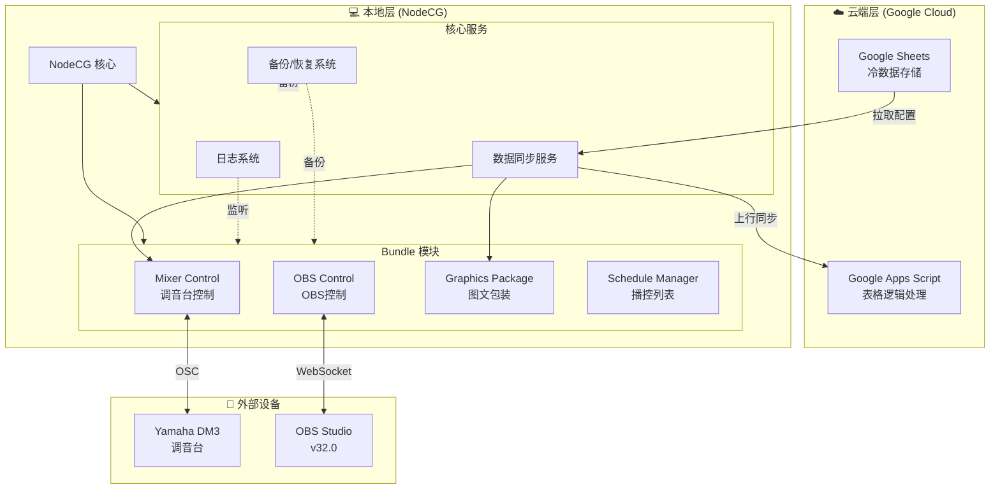
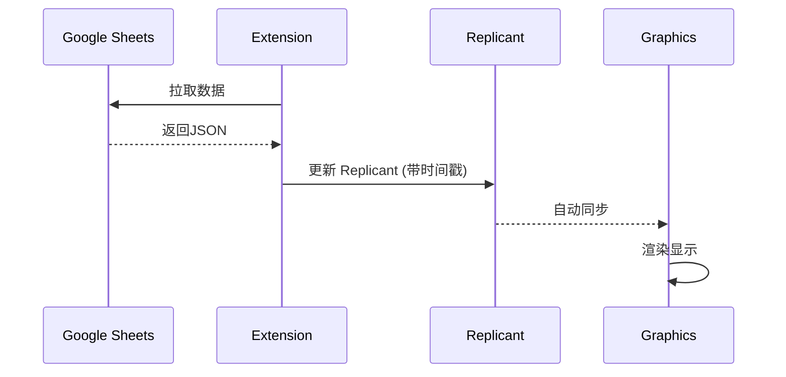
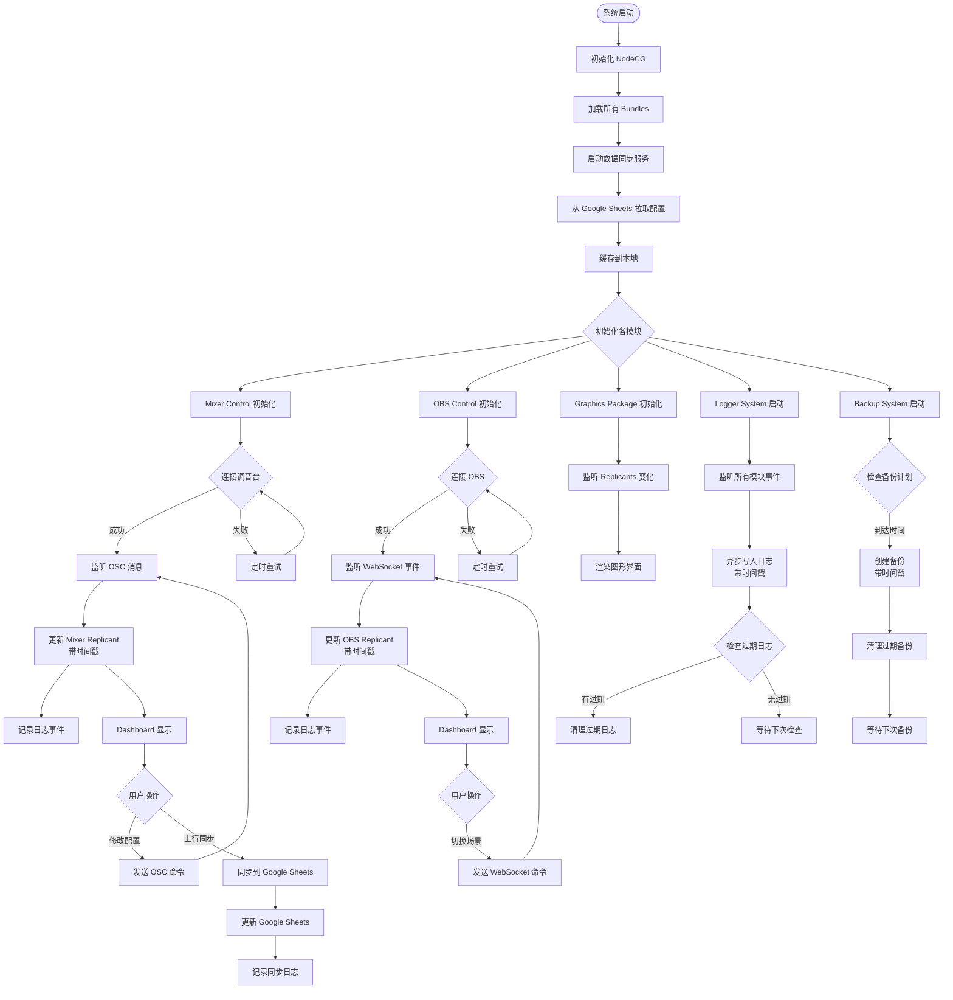
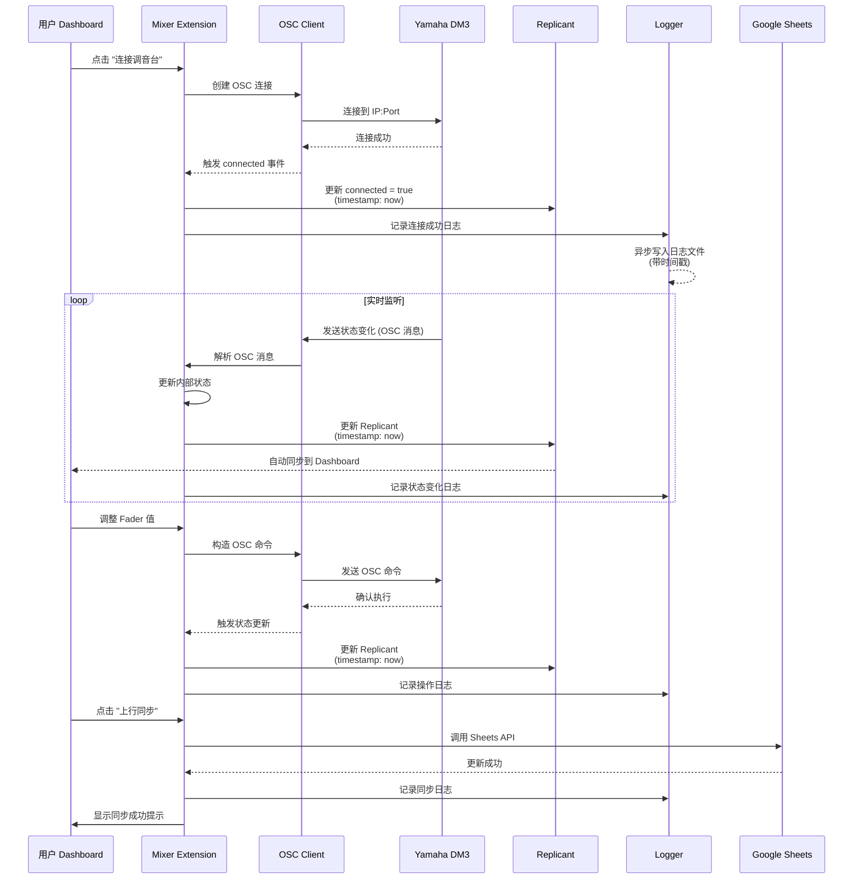
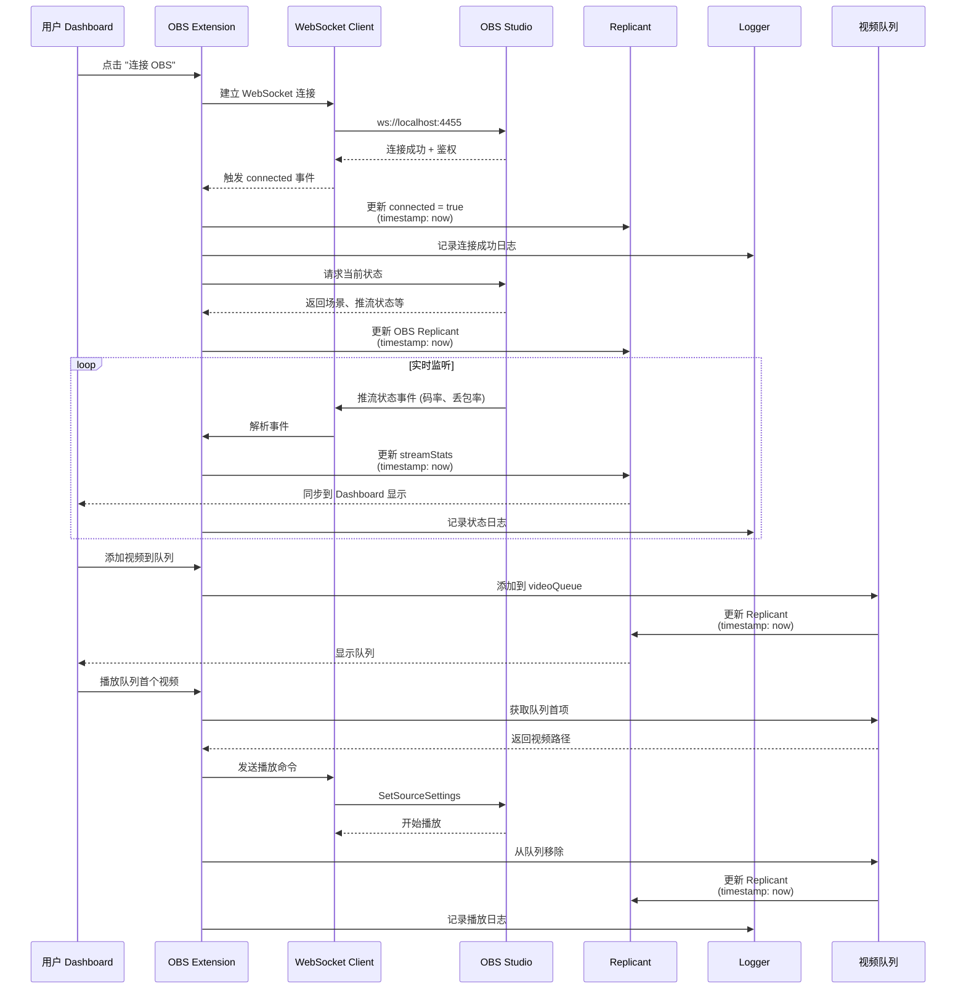
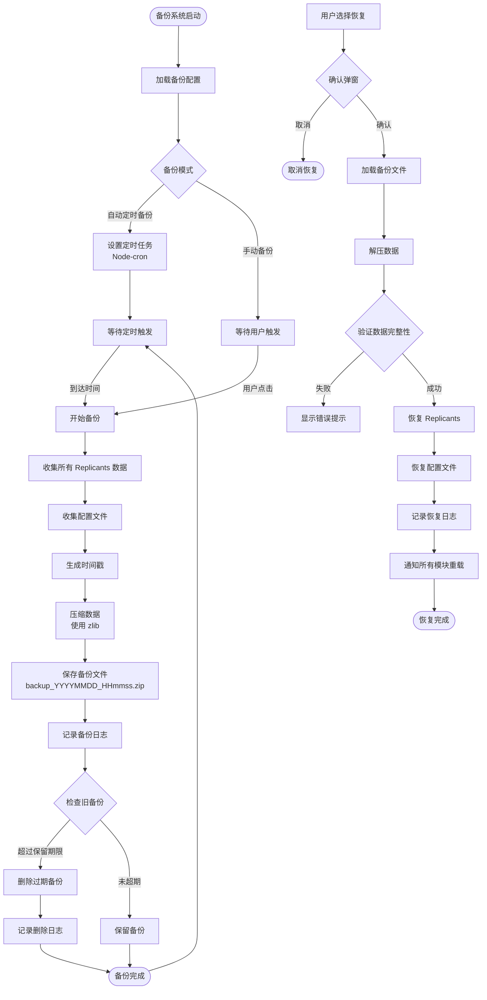

# LeafSeamer 技术栈架构方案

> 创建时间: 2025-12-04  
> 最后更新: 2025-12-04  
> 版本: v1.0

---

## 📋 概述

LeafSeamer 是一个面向直播广播控制与包装的综合性系统，采用云端-本地混合架构，实现直播场景下的调音台控制、OBS 管理、图文包装展示等功能。

### 系统特点

- **模块化设计**: 各功能模块独立、松耦合
- **高扩展性**: 单独可调用的值与方法，便于功能扩展
- **异步处理**: 本地部分采用异步机制，带时间戳
- **数据双向同步**: 云端冷数据存储 + 本地热数据处理

---

## 🏗️ 整体架构

### 架构层级



---

## 🛠️ 技术栈详解

### 1. 云端层 (Cloud Layer)

#### Google Sheets + Google Apps Script

| 组件         | 技术                 | 用途                     |
| ------------ | -------------------- | ------------------------ |
| **表 1**     | Google Sheets        | 冷数据存储与编辑         |
| **表 2**     | Google Sheets        | 快速索引查询             |
| **GAS 脚本** | JavaScript (ES6+)    | 表格间逻辑处理、数据验证 |
| **API**      | Google Sheets API v4 | 本地系统拉取数据         |

**数据类别**:

- 调音台配置 (IP、端口、patching、mute group、DCA 等)
- 图文包装数据 (游戏名、玩家名、时间估算等)
- 多语种支持 (中日英对照子表格)

---

### 2. 本地层 (Local Layer)

#### 核心框架: NodeCG

| 技术栈     | 版本       | 用途         |
| ---------- | ---------- | ------------ |
| NodeCG     | 最新稳定版 | 广播图形框架 |
| Node.js    | 18.x LTS   | 后端运行时   |
| TypeScript | 5.x        | 开发语言     |
| React      | 18.x       | 前端框架     |
| Vite       | 5.x        | 前端打包工具 |

#### 架构模式: Bundle 模块化

每个 Bundle 独立包含:

- **Graphics**: 视觉输出页面 (React 组件)
- **Dashboard**: 操作控制面板 (React 组件)
- **Extension**: 后端业务逻辑 (Node.js + TypeScript)

---

### 3. 通信协议

| 协议类型              | 用途           | 技术实现                |
| --------------------- | -------------- | ----------------------- |
| **OSC**               | 调音台控制     | `node-osc` 库           |
| **WebSocket**         | OBS 控制       | `obs-websocket-js` v5.x |
| **Google Sheets API** | 云端数据拉取   | `googleapis` 官方库     |
| **NodeCG Replicants** | 模块间数据同步 | NodeCG 内置机制         |
| **NodeCG Messages**   | 模块间事件通信 | NodeCG 内置机制         |

---

## 📦 模块详细设计

### Module 1: Mixer Control (调音台控制)

**功能职责**:

- 调音台连接状态管理
- 实时获取混音状态 (fader、channel on/off)
- 幽灵通道检测 (fader = -inf 但未关闭)
- 配置上行同步到 Google Sheets

**技术实现**:

```typescript
// Extension 结构
Bundle: mixer-control/
├── extension/
│   ├── index.ts              // 入口
│   ├── connection.ts         // OSC 连接管理
│   ├── state-manager.ts      // 状态管理器
│   ├── sync-service.ts       // 云端同步服务
│   └── types/
│       └── mixer.types.ts    // 类型定义
├── dashboard/
│   ├── mixer-dashboard.tsx   // React 控制面板
│   └── components/
│       ├── ConnectionStatus.tsx
│       ├── ChannelList.tsx
│       └── FaderControl.tsx
└── package.json
```

**核心数据结构** (Replicant):

```typescript
interface MixerState {
  timestamp: number; // 时间戳
  connected: boolean;
  connectionInfo: {
    ip: string;
    port: number;
    subnetMask: string;
  };
  mixStatus: {
    channelCount: number;
    mixCount: number;
    fxCount: number;
    matrixCount: number;
  };
  channels: Channel[]; // 可独立访问
  dcaGroups: DCAGroup[]; // 可独立访问
  muteGroups: MuteGroup[]; // 可独立访问
}
```

**异步处理策略**:

- 使用 `async/await` 处理 OSC 通信
- 每次状态变更带时间戳
- 事件驱动架构，避免轮询

---

### Module 2: OBS Control (OBS 控制)

**功能职责**:

- OBS 连接管理
- Scene Collection / Profile 切换
- 视频播放队列管理
- 推流监控 (码率、丢包率、音量电平)

**技术实现**:

```typescript
Bundle: obs-control/
├── extension/
│   ├── index.ts
│   ├── connection.ts         // WebSocket 连接
│   ├── scene-manager.ts      // 场景管理
│   ├── video-queue.ts        // 视频队列
│   └── stream-monitor.ts     // 推流监控
├── dashboard/
│   ├── obs-dashboard.tsx
│   └── components/
│       ├── SceneSelector.tsx
│       ├── VideoQueue.tsx
│       └── StreamStats.tsx
└── graphics/
    └── stream-monitor.html   // 监控显示图形
```

**核心数据结构**:

```typescript
interface OBSState {
  timestamp: number;
  connected: boolean;
  currentScene: string;
  currentProfile: string;
  videoQueue: VideoItem[]; // 可独立访问
  streamStats: {
    // 可独立访问
    bitrate: number;
    droppedFrames: number;
    audioLevel: number[];
  };
}
```

---

### Module 3: Graphics Package (图文包装)

**功能职责**:

- 从 Google Sheets 拉取展示数据
- 实时显示游戏名、玩家名、机种等信息
- 多语种切换支持

**技术实现**:

```typescript
Bundle: graphics-package/
├── extension/
│   ├── index.ts
│   └── data-fetcher.ts       // 从云端拉取数据
├── graphics/
│   ├── lower-third.html      // 下三分之一
│   ├── scoreboard.html       // 计分板
│   └── components/
│       ├── GameInfo.tsx
│       └── PlayerInfo.tsx
└── dashboard/
    └── graphics-control.tsx  // 文字编辑控制
```

**数据流**:



---

### Module 4: Schedule Manager (播控列表管理)

**功能职责**:

- 日程表管理
- 当前/下一个节目提示
- 时间估算与倒计时

**技术实现**:

```typescript
Bundle: schedule-manager/
├── extension/
│   ├── index.ts
│   ├── schedule-loader.ts    // 从云端加载日程
│   └── timer.ts              // 倒计时逻辑
├── dashboard/
│   └── schedule-panel.tsx
└── graphics/
    └── schedule-display.html
```

---

### Module 5: Logger System (日志系统)

**功能职责**:

- 全局事件日志记录
- 实时日志查询
- 基于时间/事件的视图查询
- 定期清理过期日志

**技术实现**:

```typescript
Bundle: logger-system/
├── extension/
│   ├── index.ts
│   ├── logger.ts             // 日志核心
│   ├── storage.ts            // 持久化存储
│   ├── cleaner.ts            // 定期清理
│   └── query.ts              // 查询接口
└── dashboard/
    └── log-viewer.tsx        // 日志查看器
```

**日志数据结构**:

```typescript
interface LogEntry {
  id: string;
  timestamp: number; // 时间戳
  level: "info" | "warn" | "error";
  module: string; // 来源模块
  event: string; // 事件类型
  message: string;
  metadata?: Record<string, any>;
}
```

**异步处理**:

- 使用 `async` 文件写入避免阻塞
- 日志队列机制，批量写入
- Worker Threads 进行日志清理

---

### Module 6: Backup & Recovery System (备份/恢复系统)

**功能职责**:

- 手动/自动定时备份
- 选择性恢复
- 过期备份清理

**技术实现**:

```typescript
Bundle: backup-system/
├── extension/
│   ├── index.ts
│   ├── backup-manager.ts     // 备份管理
│   ├── recovery-manager.ts   // 恢复管理
│   ├── scheduler.ts          // 定时任务
│   └── storage.ts            // 备份存储
└── dashboard/
    └── backup-panel.tsx      // 备份控制面板
```

**备份策略**:

- 备份所有 Replicants 数据
- 备份配置文件
- 增量备份 + 完整备份结合

---

### Module 7: Data Sync Service (数据同步服务)

**独立核心服务** (非 Bundle)

**功能职责**:

- 从 Google Sheets 拉取配置
- 本地配置上行同步到云端
- 缓存管理

**技术实现**:

```typescript
bundles/shared-services/
└── data-sync/
    ├── index.ts
    ├── google-sheets-client.ts
    ├── cache-manager.ts
    └── sync-scheduler.ts
```

---

## 📁 项目文件结构

```
LeafSeamer/
├── bundles/                          # NodeCG Bundles
│   ├── mixer-control/                # 调音台控制 Bundle
│   │   ├── extension/
│   │   │   ├── index.ts
│   │   │   ├── connection.ts
│   │   │   ├── state-manager.ts
│   │   │   ├── sync-service.ts
│   │   │   └── types/
│   │   │       └── mixer.types.ts
│   │   ├── dashboard/
│   │   │   ├── mixer-dashboard.tsx
│   │   │   └── components/
│   │   │       ├── ConnectionStatus.tsx
│   │   │       ├── ChannelList.tsx
│   │   │       └── FaderControl.tsx
│   │   ├── package.json
│   │   └── tsconfig.json
│   │
│   ├── obs-control/                  # OBS 控制 Bundle
│   │   ├── extension/
│   │   │   ├── index.ts
│   │   │   ├── connection.ts
│   │   │   ├── scene-manager.ts
│   │   │   ├── video-queue.ts
│   │   │   └── stream-monitor.ts
│   │   ├── dashboard/
│   │   │   ├── obs-dashboard.tsx
│   │   │   └── components/
│   │   │       ├── SceneSelector.tsx
│   │   │       ├── VideoQueue.tsx
│   │   │       └── StreamStats.tsx
│   │   ├── graphics/
│   │   │   └── stream-monitor.html
│   │   ├── package.json
│   │   └── tsconfig.json
│   │
│   ├── graphics-package/             # 图文包装 Bundle
│   │   ├── extension/
│   │   │   ├── index.ts
│   │   │   └── data-fetcher.ts
│   │   ├── graphics/
│   │   │   ├── lower-third.html
│   │   │   ├── scoreboard.html
│   │   │   └── components/
│   │   │       ├── GameInfo.tsx
│   │   │       └── PlayerInfo.tsx
│   │   ├── dashboard/
│   │   │   └── graphics-control.tsx
│   │   ├── package.json
│   │   └── tsconfig.json
│   │
│   ├── schedule-manager/             # 播控列表管理 Bundle
│   │   ├── extension/
│   │   │   ├── index.ts
│   │   │   ├── schedule-loader.ts
│   │   │   └── timer.ts
│   │   ├── dashboard/
│   │   │   └── schedule-panel.tsx
│   │   ├── graphics/
│   │   │   └── schedule-display.html
│   │   ├── package.json
│   │   └── tsconfig.json
│   │
│   ├── logger-system/                # 日志系统 Bundle
│   │   ├── extension/
│   │   │   ├── index.ts
│   │   │   ├── logger.ts
│   │   │   ├── storage.ts
│   │   │   ├── cleaner.ts
│   │   │   └── query.ts
│   │   ├── dashboard/
│   │   │   └── log-viewer.tsx
│   │   ├── package.json
│   │   └── tsconfig.json
│   │
│   ├── backup-system/                # 备份/恢复系统 Bundle
│   │   ├── extension/
│   │   │   ├── index.ts
│   │   │   ├── backup-manager.ts
│   │   │   ├── recovery-manager.ts
│   │   │   ├── scheduler.ts
│   │   │   └── storage.ts
│   │   ├── dashboard/
│   │   │   └── backup-panel.tsx
│   │   ├── package.json
│   │   └── tsconfig.json
│   │
│   └── shared-services/              # 共享服务
│       └── data-sync/
│           ├── index.ts
│           ├── google-sheets-client.ts
│           ├── cache-manager.ts
│           └── sync-scheduler.ts
│
├── shared/                           # 跨 Bundle 共享代码
│   ├── types/                        # 全局类型定义
│   │   ├── mixer.types.ts
│   │   ├── obs.types.ts
│   │   ├── graphics.types.ts
│   │   └── common.types.ts
│   ├── utils/                        # 工具函数
│   │   ├── logger.ts
│   │   ├── timestamp.ts
│   │   └── validators.ts
│   └── constants/                    # 常量定义
│       └── index.ts
│
├── cfg/                              # NodeCG 配置目录
│   └── leafseamer.json               # 主配置文件
│
├── db/                               # Replicants 持久化存储
│
├── logs/                             # 日志文件目录
│
├── backups/                          # 备份文件目录
│
├── assets/                           # 静态资源
│   ├── videos/                       # 视频队列文件
│   └── images/
│
├── projectdocuments/                 # 项目文档
│   ├── needs.md                      # 需求文档
│   ├── prompt.md
│   ├── 技术栈架构方案.md             # 本文档
│   ├── 系统流程图.md                 # 流程图文档
│   └── API文档.md                    # 待创建
│
├── package.json                      # 根项目依赖
├── tsconfig.json                     # TypeScript 配置
├── .gitignore
└── README.md
```

---

## 🔄 系统流程图

### 整体数据流



### Mixer Control 详细流程



### OBS Control 详细流程



### 备份系统流程



---

## 🔧 技术细节

### 1. 异步处理机制

所有 Extension 模块均采用 **异步优先** 策略:

#### 示例: OSC 消息异步处理

```typescript
// mixer-control/extension/connection.ts

import { EventEmitter } from "events";
import * as osc from "node-osc";

export class MixerConnection extends EventEmitter {
  private client: osc.Client;
  private server: osc.Server;

  async connect(ip: string, port: number): Promise<void> {
    return new Promise((resolve, reject) => {
      try {
        this.client = new osc.Client(ip, port);
        this.server = new osc.Server(port + 1, "0.0.0.0", async () => {
          // 连接成功后异步初始化
          await this.initializeState();
          resolve();
        });

        // 异步监听消息
        this.server.on("message", async (msg) => {
          const timestamp = Date.now();
          await this.handleMessage(msg, timestamp);
        });
      } catch (error) {
        reject(error);
      }
    });
  }

  private async handleMessage(msg: any[], timestamp: number): Promise<void> {
    // 解析消息
    const [address, ...args] = msg;

    // 异步处理并带时间戳
    const event = {
      address,
      args,
      timestamp,
    };

    this.emit("stateChange", event);
  }
}
```

#### 示例: 日志异步写入

```typescript
// logger-system/extension/logger.ts

import { promises as fs } from "fs";
import { Queue } from "async";

export class Logger {
  private writeQueue: Queue<LogEntry>;

  constructor() {
    // 创建异步队列，批量写入
    this.writeQueue = new Queue(async (entry: LogEntry) => {
      await this.writeToFile(entry);
    }, 10); // 并发 10 个写入任务
  }

  log(
    level: string,
    module: string,
    event: string,
    message: string,
    metadata?: any
  ): void {
    const entry: LogEntry = {
      id: generateId(),
      timestamp: Date.now(), // 时间戳
      level,
      module,
      event,
      message,
      metadata,
    };

    // 推入异步队列
    this.writeQueue.push(entry);

    // 同时更新内存中的 Replicant (实时查询用)
    this.updateReplicant(entry);
  }

  private async writeToFile(entry: LogEntry): Promise<void> {
    const logPath = `./logs/${new Date().toISOString().split("T")[0]}.log`;
    const logLine = JSON.stringify(entry) + "\n";

    await fs.appendFile(logPath, logLine, "utf-8");
  }
}
```

### 2. 时间戳策略

所有状态变更、日志、备份均带 **Unix 时间戳** (毫秒级):

```typescript
// shared/utils/timestamp.ts

export function getCurrentTimestamp(): number {
  return Date.now();
}

export function formatTimestamp(timestamp: number): string {
  return new Date(timestamp).toISOString();
}

export function isExpired(timestamp: number, expiryDays: number): boolean {
  const now = Date.now();
  const diff = now - timestamp;
  const days = diff / (1000 * 60 * 60 * 24);
  return days > expiryDays;
}
```

### 3. 独立可调用的值设计

使用 **NodeCG Replicants** 的特性，每个子状态可独立访问:

```typescript
// 在任意 Extension 或 Dashboard 中访问

// 获取整个 Mixer 状态
const mixerState = nodecg.Replicant<MixerState>("mixerState");

// 仅获取 channels (独立可调用)
const channels = nodecg.Replicant<Channel[]>("mixerChannels");

// 仅获取 DCA groups (独立可调用)
const dcaGroups = nodecg.Replicant<DCAGroup[]>("mixerDCAGroups");

// 单个 Channel 访问 (通过消息系统)
nodecg.sendMessage("getChannel", { id: 1 }, (err, channel) => {
  console.log(channel);
});
```

### 4. 模块间通信

**Replicants** (状态同步):

```typescript
// Extension 更新
mixerState.value = newState;

// Dashboard 自动接收
mixerState.on("change", (newValue) => {
  console.log("Mixer state changed:", newValue);
});
```

**Messages** (事件通信):

```typescript
// 发送方
nodecg.sendMessage("mixerConnected", { ip: "192.168.1.100" });

// 接收方
nodecg.listenFor("mixerConnected", (data) => {
  console.log("Mixer connected at:", data.ip);
});
```

---

## 📊 扩展性设计

### 1. 新增 Bundle 模块

遵循 NodeCG Bundle 标准结构:

1. 在 `bundles/` 下创建新文件夹
2. 包含 `package.json` 声明 graphics/dashboard
3. Extension 按需实现业务逻辑
4. 使用 Replicants/Messages 与其他模块通信

### 2. 新增调音台型号支持

在 `mixer-control` 中扩展:

```typescript
// mixer-control/extension/adapters/

export interface MixerAdapter {
  connect(config: ConnectionConfig): Promise<void>;
  disconnect(): Promise<void>;
  sendCommand(command: MixerCommand): Promise<void>;
  getState(): Promise<MixerState>;
}

// 现有 Yamaha DM3
export class YamahaDM3Adapter implements MixerAdapter { ... }

// 新增其他型号
export class BehringerX32Adapter implements MixerAdapter { ... }
export class AllenHeathSQAdapter implements MixerAdapter { ... }
```

### 3. 新增 OBS 功能

在 `obs-control` 中扩展:

```typescript
// obs-control/extension/features/

export abstract class OBSFeature {
  abstract initialize(): Promise<void>;
  abstract cleanup(): Promise<void>;
}

export class VideoQueueFeature extends OBSFeature { ... }
export class MultiOBSFeature extends OBSFeature { ... }  // 未来扩展
```

---

## 🚀 部署与运行

### 开发环境

```bash
# 安装依赖
npm install

# 启动 NodeCG 开发服务器
npm run dev

# 访问 Dashboard
http://localhost:9090
```

### 生产环境

推荐使用 **PM2** 或 **Docker**:

```bash
# PM2
pm2 start npm --name "leafseamer" -- start

# Docker (待创建 Dockerfile)
docker-compose up -d
```

---

## 📝 总结

本技术栈架构方案基于以下核心原则设计:

1. ✅ **模块化**: 使用 NodeCG Bundle 架构，各模块独立开发、测试、部署
2. ✅ **高扩展性**: Replicants 模式支持独立访问子状态，便于功能扩展
3. ✅ **异步处理**: 所有 I/O 操作异步化，带时间戳记录
4. ✅ **云端-本地混合**: Google Sheets 冷数据存储，本地热数据实时处理
5. ✅ **容错与恢复**: 完善的日志系统和备份/恢复机制

---

> 本文档将随项目演进实时更新，保持与实际代码同步。
