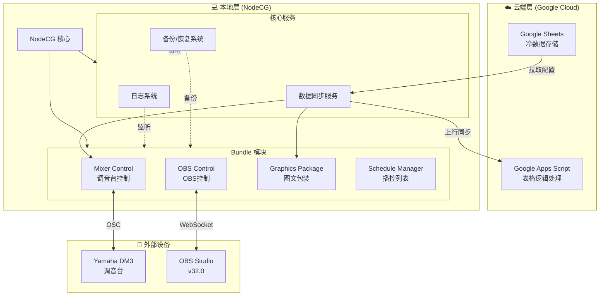
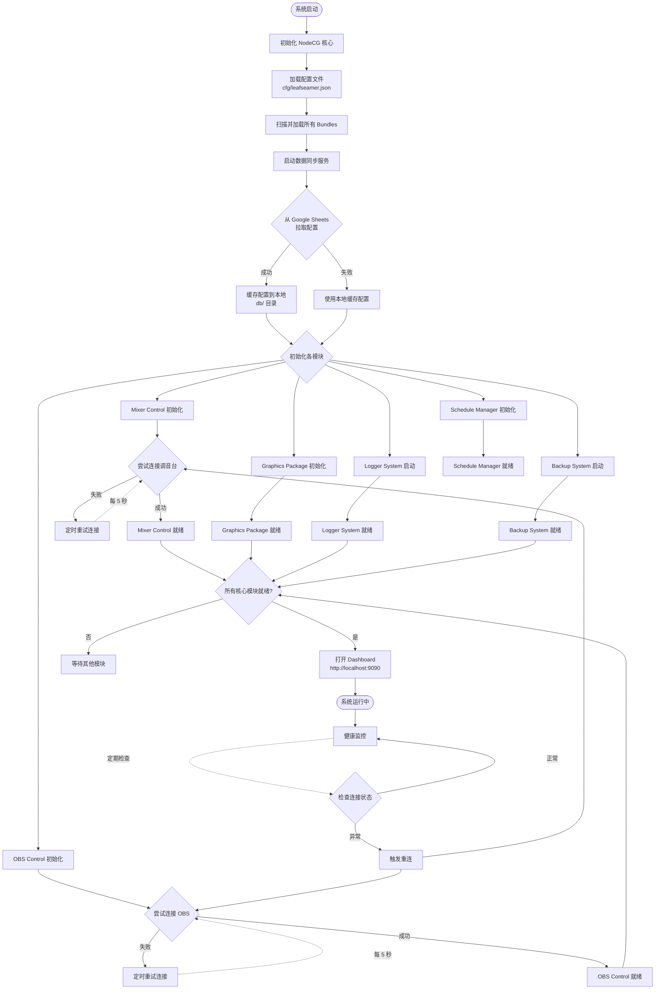
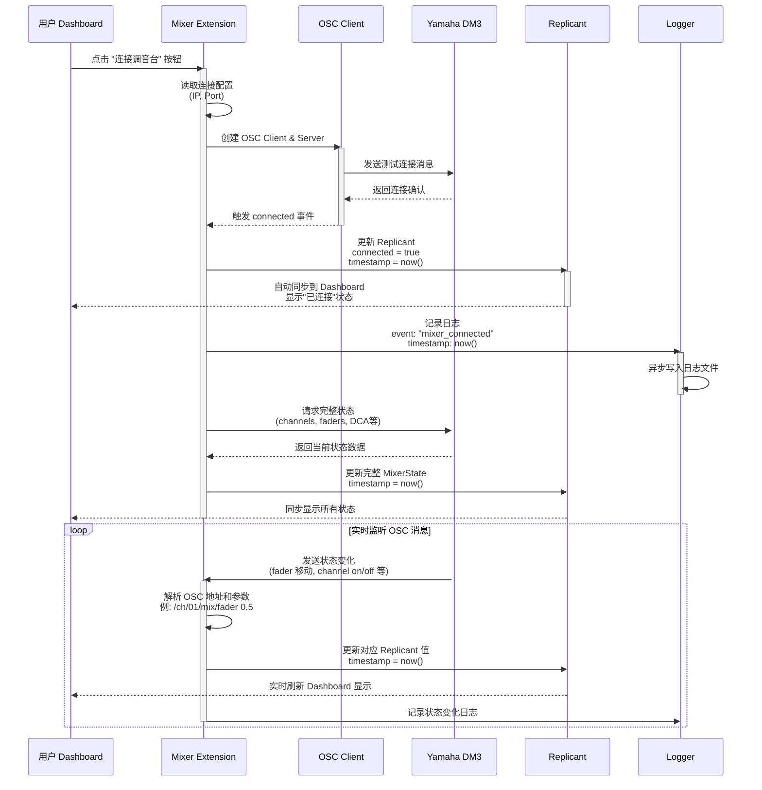
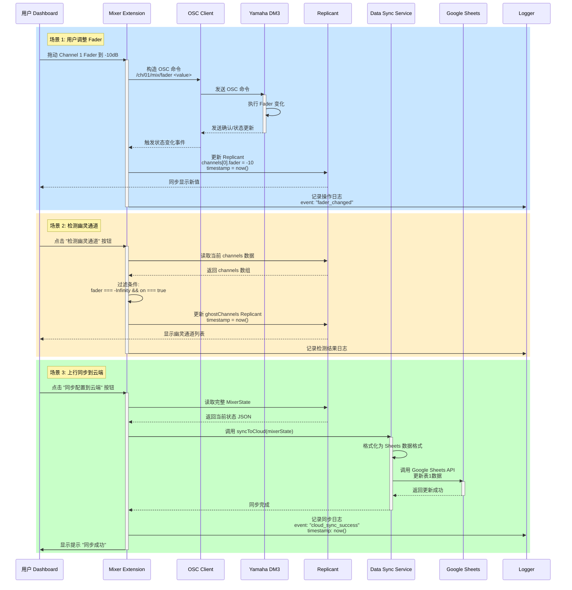
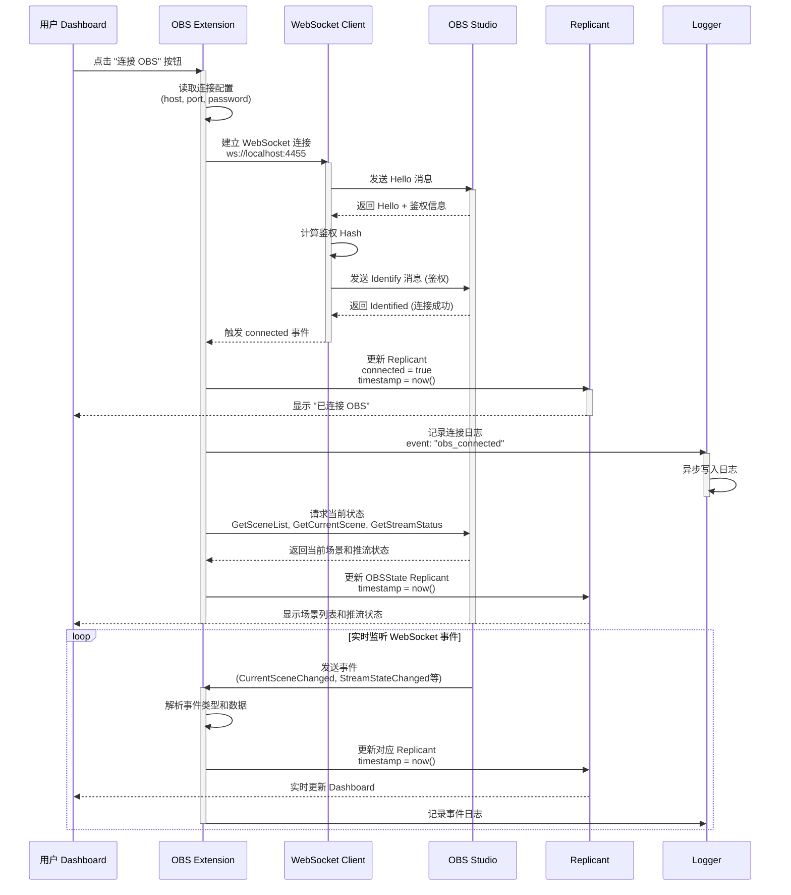
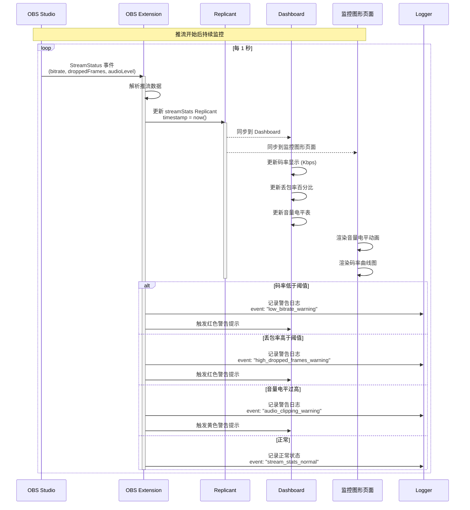
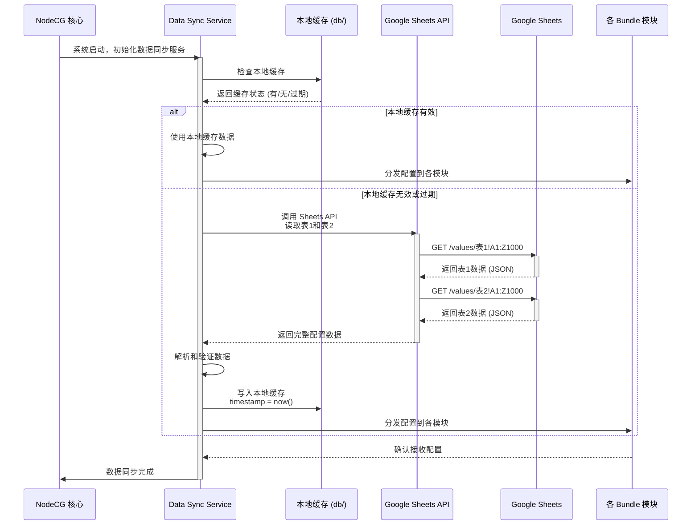
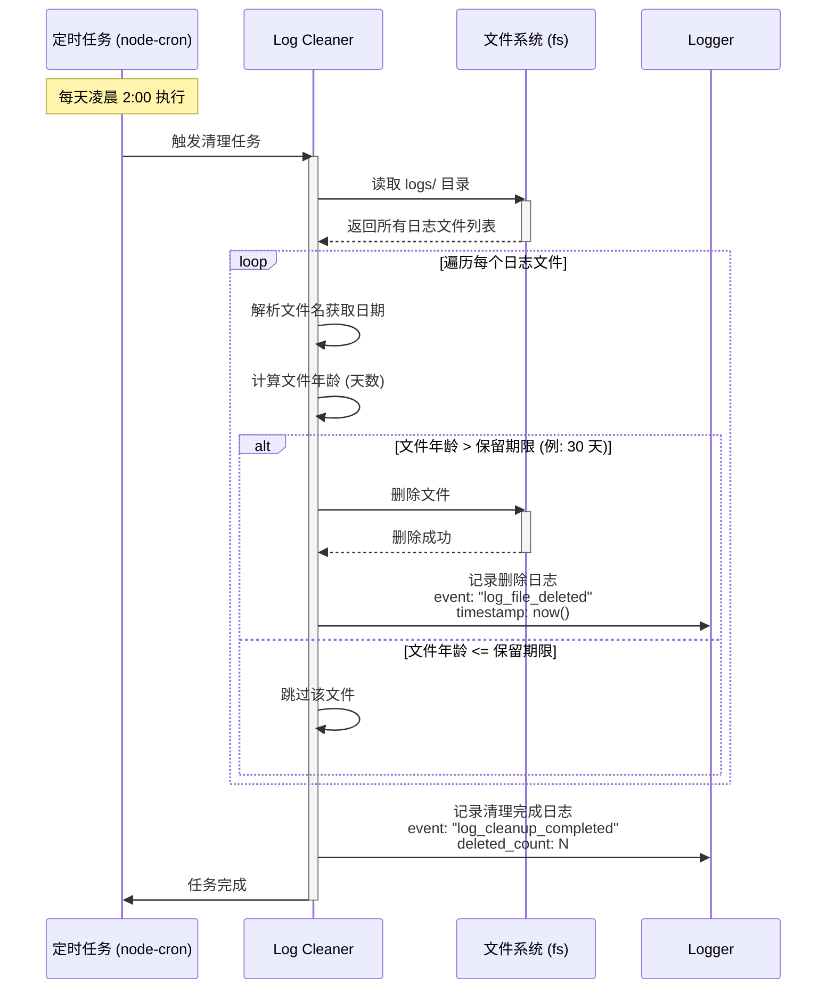
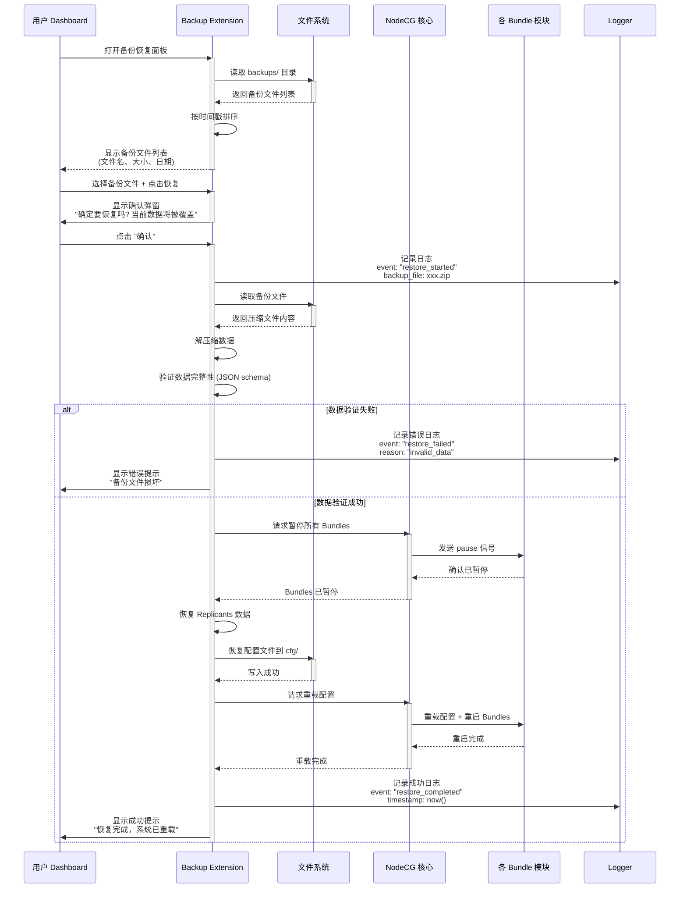

# LeafSeamer 系统流程图

> 创建时间: 2025-12-04  
> 最后更新: 2025-12-04  
> 版本: v1.0

本文档包含 LeafSeamer 系统的各类流程图，帮助理解系统运作机制。

---

## 📊 目录

1. [系统架构总览](#系统架构总览)
2. [启动流程](#启动流程)
3. [Mixer Control 工作流](#mixer-control-工作流)
4. [OBS Control 工作流](#obs-control-工作流)
5. [数据同步流程](#数据同步流程)
6. [日志系统流程](#日志系统流程)
7. [备份恢复流程](#备份恢复流程)

---

## 系统架构总览



---

## 启动流程



---

## Mixer Control 工作流

### 连接与状态监听



### 用户操作与上行同步



### 幽灵通道检测算法

```mermaid
flowchart TD
    Start([开始检测幽灵通道]) --> GetChannels[获取所有 Channel 数据]
    GetChannels --> InitGhostList[初始化空幽灵通道列表]

    InitGhostList --> LoopChannels{遍历所有 Channel}
    LoopChannels -->|有下一个| CheckFader{Fader 值 = -∞ ?}
    LoopChannels -->|无| ReturnResult[返回幽灵通道列表]

    CheckFader -->|否| LoopChannels
    CheckFader -->|是| CheckOn{Channel On = true ?}

    CheckOn -->|否| LoopChannels
    CheckOn -->|是| AddToGhost[添加到幽灵通道列表]
    AddToGhost --> LoopChannels

    ReturnResult --> UpdateReplicant[更新 ghostChannels Replicant<br/>timestamp = now()]
    UpdateReplicant --> LogResult[记录日志:<br/>找到 N 个幽灵通道]
    LogResult --> End([检测完成])
```

---

## OBS Control 工作流

### 连接与场景管理



### 视频队列管理流程

```mermaid
flowchart TD
    Start([用户打开视频队列管理]) --> ShowQueue[显示当前队列列表]
    ShowQueue --> UserAction{用户操作}

    UserAction -->|添加视频| BrowseFile[浏览本地文件]
    BrowseFile --> SelectVideo{选择视频文件}
    SelectVideo -->|取消| ShowQueue
    SelectVideo -->|确认| ValidateFile{验证文件格式}

    ValidateFile -->|不支持| ShowError[显示错误提示<br/>"不支持的格式"]
    ShowError --> ShowQueue
    ValidateFile -->|支持| AddToQueue[添加到 videoQueue 数组]

    AddToQueue --> UpdateRep1[更新 videoQueue Replicant<br/>timestamp = now()]
    UpdateRep1 --> LogAdd[记录日志: video_added]
    LogAdd --> ShowQueue

    UserAction -->|播放首个视频| CheckQueue{队列是否为空?}
    CheckQueue -->|是| ShowEmpty[显示 "队列为空" 提示]
    ShowEmpty --> ShowQueue
    CheckQueue -->|否| GetFirst[获取队列首项视频]

    GetFirst --> SendToOBS[通过 WebSocket 发送<br/>SetSourceSettings 命令]
    SendToOBS --> OBSPlay{OBS 播放成功?}

    OBSPlay -->|失败| ShowPlayError[显示播放失败提示]
    ShowPlayError --> ShowQueue
    OBSPlay -->|成功| RemoveFromQueue[从队列移除首项]

    RemoveFromQueue --> UpdateRep2[更新 videoQueue Replicant<br/>timestamp = now()]
    UpdateRep2 --> LogPlay[记录日志: video_played]
    LogPlay --> ShowQueue

    UserAction -->|删除视频| SelectDelete{选择要删除的视频}
    SelectDelete --> ConfirmDelete{确认删除?}
    ConfirmDelete -->|取消| ShowQueue
    ConfirmDelete -->|确认| RemoveItem[从队列移除该项]

    RemoveItem --> UpdateRep3[更新 videoQueue Replicant<br/>timestamp = now()]
    UpdateRep3 --> LogDelete[记录日志: video_removed]
    LogDelete --> ShowQueue
```

### 推流监控流程



---

## 数据同步流程

### 启动时拉取配置



### 上行同步到云端

```mermaid
flowchart TD
    Start([用户触发上行同步]) --> ValidateData[验证本地数据完整性]
    ValidateData --> CheckValid{数据是否有效?}

    CheckValid -->|否| ShowError[显示错误提示<br/>同步失败]
    ShowError --> End([结束])

    CheckValid -->|是| ReadReplicant[读取当前 Replicant 数据<br/>(例: MixerState)]
    ReadReplicant --> FormatData[格式化为 Sheets 数据格式<br/>(二维数组)]

    FormatData --> CallAPI[调用 Google Sheets API<br/>batchUpdate]
    CallAPI --> APIRequest{API 请求}

    APIRequest -->|网络错误| RetryCheck{重试次数 < 3?}
    RetryCheck -->|是| Wait[等待 3 秒]
    Wait --> CallAPI
    RetryCheck -->|否| SyncFailed[同步失败]
    SyncFailed --> LogError[记录错误日志<br/>event: "cloud_sync_failed"]
    LogError --> ShowError

    APIRequest -->|成功| UpdateSheet[更新 Google Sheets]
    UpdateSheet --> WriteTimestamp[写入同步时间戳到表格]
    WriteTimestamp --> UpdateCache[更新本地缓存<br/>timestamp = now()]

    UpdateCache --> LogSuccess[记录成功日志<br/>event: "cloud_sync_success"<br/>timestamp: now()]
    LogSuccess --> ShowSuccess[显示成功提示<br/>"同步完成"]
    ShowSuccess --> End
```

---

## 日志系统流程

### 日志记录与查询

```mermaid
flowchart TD
    Start([事件发生]) --> EmitEvent[模块触发日志事件<br/>logger.log(...)]
    EmitEvent --> CreateEntry[创建 LogEntry 对象<br/>timestamp = now()]

    CreateEntry --> PushQueue[推入异步写入队列]
    PushQueue --> UpdateMemory[更新内存中的 Replicant<br/>(用于实时查询)]

    UpdateMemory --> QueueProcess{队列处理}
    QueueProcess --> BatchWrite[批量写入日志文件<br/>(每 100 条或每 5 秒)]

    BatchWrite --> FormatLog[格式化为 JSON Lines]
    FormatLog --> WriteFile[异步写入到<br/>logs/YYYY-MM-DD.log]
    WriteFile --> WriteDone[写入完成]

    WriteDone --> CheckSize{日志文件大小 > 100MB?}
    CheckSize -->|是| RotateLog[轮转日志文件<br/>重命名为 .log.1]
    CheckSize -->|否| WaitNext[等待下次写入]
    RotateLog --> WaitNext

    subgraph Query["日志查询流程"]
        UserQuery([用户查询日志]) --> QueryType{查询类型}
        QueryType -->|实时查询| QueryMemory[从 Replicant 查询<br/>(最近 1000 条)]
        QueryType -->|历史查询| QueryFile[从日志文件查询]

        QueryMemory --> FilterMemory{应用过滤条件<br/>(时间/事件/模块)}
        QueryFile --> ReadFile[读取对应日期文件]
        ReadFile --> FilterFile{应用过滤条件}

        FilterMemory --> ReturnResult[返回查询结果]
        FilterFile --> ReturnResult
        ReturnResult --> DisplayDashboard[在 Dashboard 显示]
    end
```

### 定期清理过期日志



---

## 备份恢复流程

### 自动定时备份

```mermaid
flowchart TD
    Start([定时触发<br/>例: 每天 03:00]) --> CheckMode{备份模式}

    CheckMode -->|自动备份已启用| StartBackup[开始备份流程]
    CheckMode -->|自动备份已禁用| Skip([跳过备份])

    StartBackup --> CreateTimestamp[生成时间戳<br/>YYYYMMDD_HHmmss]
    CreateTimestamp --> CollectReplicants[收集所有 Replicants 数据]

    CollectReplicants --> SerializeData[序列化为 JSON]
    SerializeData --> CollectConfig[收集配置文件<br/>cfg/*.json]

    CollectConfig --> CreateArchive[创建压缩包]
    CreateArchive --> CompressData[使用 zlib 压缩]

    CompressData --> SaveFile[保存为<br/>backups/backup_YYYYMMDD_HHmmss.zip]
    SaveFile --> VerifyBackup{验证备份完整性}

    VerifyBackup -->|失败| LogError[记录错误日志<br/>event: "backup_failed"]
    VerifyBackup -->|成功| LogSuccess[记录成功日志<br/>event: "backup_created"<br/>timestamp: now()]

    LogSuccess --> CheckOldBackups[检查旧备份文件]
    CheckOldBackups --> FilterOld{过滤过期备份<br/>(例: > 7 天)}

    FilterOld -->|有过期文件| DeleteOld[删除过期备份]
    FilterOld -->|无过期文件| Done([备份完成])

    DeleteOld --> LogDelete[记录删除日志<br/>event: "old_backup_deleted"]
    LogDelete --> Done
    LogError --> Done
```

### 手动恢复流程



---

## 📝 总结

本文档提供了 LeafSeamer 系统的核心流程图，涵盖：

- ✅ **系统启动**: NodeCG 核心初始化、Bundle 加载、外部设备连接
- ✅ **Mixer Control**: OSC 连接、状态监听、用户操作、云端同步
- ✅ **OBS Control**: WebSocket 连接、场景管理、视频队列、推流监控
- ✅ **数据同步**: 云端拉取配置、本地缓存、上行同步
- ✅ **日志系统**: 异步写入、实时查询、定期清理
- ✅ **备份恢复**: 自动定时备份、手动恢复、数据验证

---

> 本文档将随项目演进实时更新，保持与实际代码同步。
